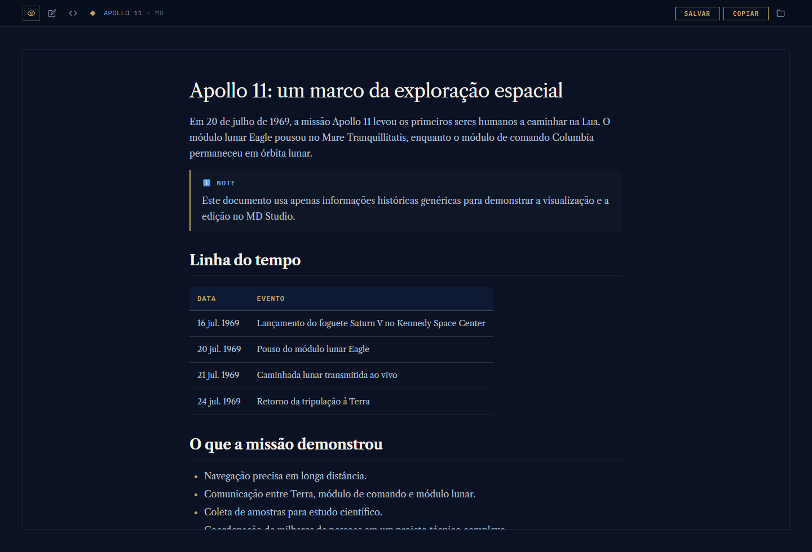

# MD Studio

MD Studio é um visualizador e editor de Markdown em arquivo HTML único. Ele foi feito para abrir documentos `.md` no navegador com uma leitura mais agradável, mantendo também modos de edição inline e edição do código-fonte Markdown.



## Como usar

Abra o arquivo `md-studio.html` diretamente no navegador.

No PowerShell:

```powershell
Invoke-Item .\md-studio.html
```

Também é possível arrastar um arquivo Markdown para a tela inicial, usar o botão **ABRIR ARQUIVO** ou pressionar `Ctrl+O`.

## Recursos

- Abertura de arquivos `.md`, `.markdown`, `.mdown`, `.mkd` e `.txt`.
- Modo **Preview** para leitura formatada.
- Modo de edição inline diretamente sobre o documento renderizado.
- Modo de edição do código-fonte Markdown.
- Atalhos `Ctrl+O`, `Ctrl+E`, `Ctrl+U` e `Ctrl+S`.
- Renderização de tabelas, listas, blocos de código e alertas no estilo GitHub.
- Destaque de sintaxe com highlight.js.
- Diagramas Mermaid em blocos `mermaid`.
- Expressões matemáticas com KaTeX.
- Botão para copiar blocos de código.
- Cópia do conteúdo Markdown completo para a área de transferência.
- Salvamento pelo File System Access API quando o navegador suporta esse recurso; em outros casos, o app usa download do arquivo.

## Edição

O botão de edição abre o documento em modo visual, permitindo alterar o conteúdo renderizado. O botão de código-fonte alterna para um editor de texto com o Markdown original.


## Exemplo seguro para demonstração

O arquivo `.app/examples/apollo-11.md` contém um Markdown genérico sobre a missão Apollo 11. Ele foi criado para gerar os screenshots deste README sem expor dados pessoais, documentos internos ou informações sensíveis.

## Dependências

O app não tem etapa de build ou servidor para uso normal. As bibliotecas de renderização são carregadas por CDN quando o HTML é aberto:

- Google Fonts
- marked
- highlight.js
- Mermaid
- KaTeX
- Turndown
- turndown-plugin-gfm

Por isso, a experiência completa depende de acesso à internet, a menos que essas dependências sejam vendorizadas no futuro.

## Regenerar screenshots

Os screenshots do README foram gerados com Playwright a partir do Markdown genérico em `.app/examples/apollo-11.md`.

```powershell
cd .app
npm install
npm run screenshots
cd ..
```

## Estrutura

```text
README.md       Documentação pública
md-studio.html  Aplicação completa
.app/           Arquivos auxiliares ocultos, como screenshots, exemplo e script de captura
```
