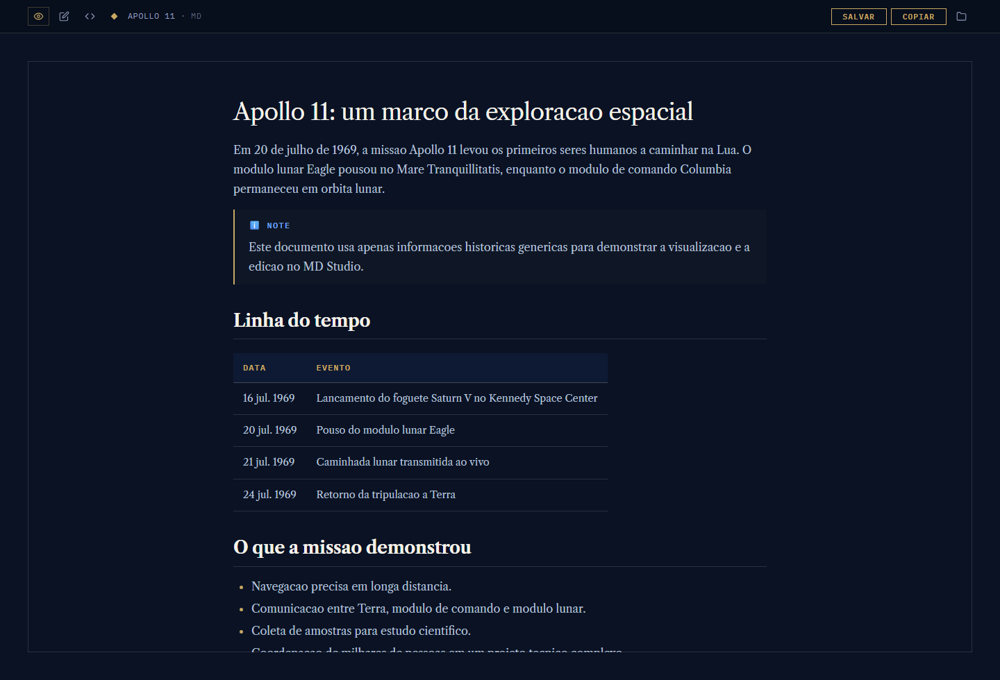
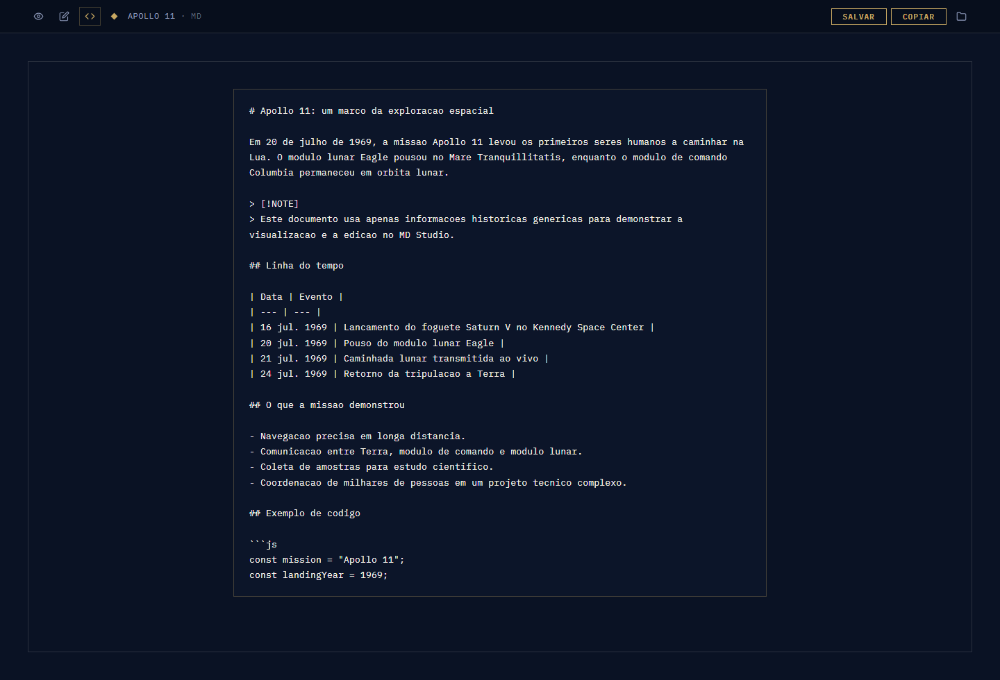

# MD Studio

MD Studio e um visualizador e editor de Markdown em arquivo HTML unico. Ele foi feito para abrir documentos `.md` no navegador com uma leitura mais agradavel, mantendo tambem modos de edicao inline e edicao do codigo-fonte Markdown.



## Como usar

Abra o arquivo `md-studio.html` diretamente no navegador.

No PowerShell:

```powershell
Invoke-Item .\md-studio.html
```

Tambem e possivel arrastar um arquivo Markdown para a tela inicial, usar o botao **ABRIR ARQUIVO** ou pressionar `Ctrl+O`.

## Recursos

- Abertura de arquivos `.md`, `.markdown`, `.mdown`, `.mkd` e `.txt`.
- Modo **Preview** para leitura formatada.
- Modo de edicao inline diretamente sobre o documento renderizado.
- Modo de edicao do codigo-fonte Markdown.
- Atalhos `Ctrl+O`, `Ctrl+E`, `Ctrl+U` e `Ctrl+S`.
- Renderizacao de tabelas, listas, blocos de codigo e alertas no estilo GitHub.
- Destaque de sintaxe com highlight.js.
- Diagramas Mermaid em blocos `mermaid`.
- Expressoes matematicas com KaTeX.
- Botao para copiar blocos de codigo.
- Copia do conteudo Markdown completo para a area de transferencia.
- Salvamento pelo File System Access API quando o navegador suporta esse recurso; em outros casos, o app usa download do arquivo.

## Edicao

O botao de edicao abre o documento em modo visual, permitindo alterar o conteudo renderizado. O botao de codigo-fonte alterna para um editor de texto com o Markdown original.



## Exemplo seguro para demonstracao

O arquivo `examples/apollo-11.md` contem um Markdown generico sobre a missao Apollo 11. Ele foi criado para gerar os screenshots deste README sem expor dados pessoais, documentos internos ou informacoes sensiveis.

## Dependencias

O app nao tem etapa de build ou servidor para uso normal. As bibliotecas de renderizacao sao carregadas por CDN quando o HTML e aberto:

- Google Fonts
- marked
- highlight.js
- Mermaid
- KaTeX
- Turndown
- turndown-plugin-gfm

Por isso, a experiencia completa depende de acesso a internet, a menos que essas dependencias sejam vendorizadas no futuro.

## Regenerar screenshots

Os screenshots do README foram gerados com Playwright a partir do Markdown generico em `examples/apollo-11.md`.

```powershell
npm install
npm run screenshots
```

## Estrutura

```text
md-studio.html          Aplicacao completa
examples/apollo-11.md  Markdown generico usado nos screenshots
screenshots/           Imagens usadas neste README
scripts/               Script opcional para regenerar screenshots
```
