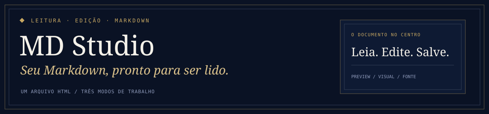
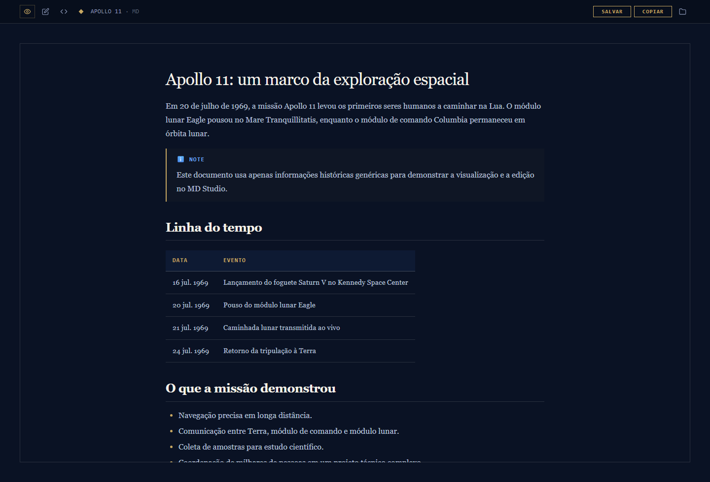
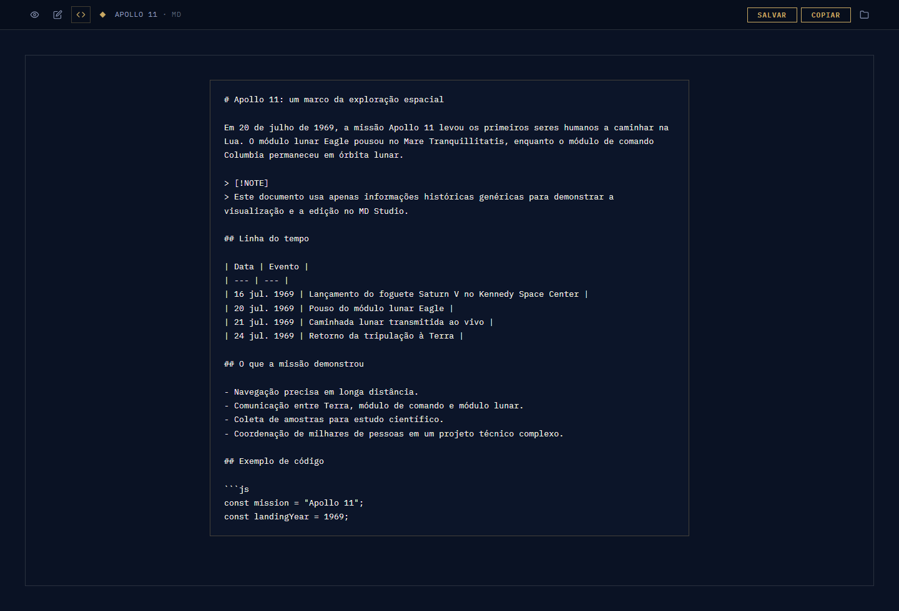

# MD Studio

**Seu Markdown, pronto para ser lido. Um HTML, três modos de trabalho.**

Abra seus documentos no navegador, leia uma versão formatada, faça ajustes no próprio texto ou edite o código Markdown. O MD Studio reúne essas tarefas em um arquivo que pode ser usado offline depois de baixado.

**[Conheça a página do MD Studio ↗](https://brunoflma.github.io/md-studio/)** · [Baixar o projeto](https://github.com/brunoflma/md-studio/archive/refs/heads/main.zip) · [Arquivo do aplicativo](md-studio.html) · [Compartilhar experiência](https://github.com/brunoflma/md-studio/issues/new?template=experiencia.yml)

Se o MD Studio for útil, use **Star** no topo do repositório para salvá-lo e demonstrar apoio. A estrela é opcional; o download está disponível para você experimentar e avaliar.



## Abra e comece

1. Baixe o ZIP do projeto e extraia os arquivos.
2. Abra **`md-studio.html`** no navegador.
3. Arraste um documento para a tela, clique em **ABRIR ARQUIVO** ou use `Ctrl+O`.

Quer testar com um documento pronto? [Baixe o exemplo de notas de pesquisa](docs/examples/notas-de-pesquisa.md) ou [explore os modos e o prompt para seu agente de IA](https://brunoflma.github.io/md-studio/#comecar).

No Windows, também é possível abrir pelo PowerShell:

```powershell
Invoke-Item .\md-studio.html
```

## Escolha como trabalhar

| Modo | Para usar quando |
| :--- | :--- |
| **Preview** | Você quer ler um relatório, uma documentação ou uma nota sem o ruído da marcação. |
| **Edição visual** | Você quer ajustar o conteúdo diretamente no documento renderizado. |
| **Código-fonte** | Você precisa controlar a estrutura e a sintaxe do Markdown. |

### O que o visualizador entende

- Tabelas, listas e alertas no estilo GitHub.
- Blocos de código com destaque de sintaxe e botão de copiar.
- Diagramas escritos em Mermaid.
- Expressões matemáticas renderizadas com KaTeX.
- Arquivos `.md`, `.markdown`, `.mdown`, `.mkd` e `.txt`.

## Atalhos e salvamento

| Atalho | Ação |
| :--- | :--- |
| `Ctrl+O` | Abrir documento |
| `Ctrl+E` | Alternar a edição visual |
| `Ctrl+U` | Alternar o código-fonte |
| `Ctrl+S` | Salvar |

Nos navegadores compatíveis, o salvamento utiliza a File System Access API. Nos demais, o aplicativo baixa um arquivo com o conteúdo. Também é possível copiar todo o Markdown para a área de transferência.

A edição visual converte o conteúdo renderizado de volta para Markdown, e a representação pode mudar. Para controlar uma sintaxe específica, use **Código-fonte** e confira o arquivo salvo. Não conte com salvamento automático.

<details>
<summary><strong>Veja o modo de edição</strong></summary>



</details>

## Um aplicativo que cabe em um arquivo

O uso normal não exige build, servidor ou instalação de dependências. As bibliotecas já estão embutidas em `md-studio.html`.

Imagens e outros recursos externos referenciados no próprio documento podem precisar de internet.

Para desenvolvimento, o repositório mantém ferramentas auxiliares em [.app](.app). O aplicativo utiliza marked, highlight.js, Mermaid, KaTeX, Turndown e turndown-plugin-gfm.

A apresentação publicada no GitHub Pages fica em [docs](docs). Para conferir seus links, exemplos, capturas e identidade visual, execute `node .app/scripts/verify-site.cjs` na raiz do projeto. Isso não exige instalar dependências.

## Contribua

Encontrou um Markdown que não renderiza como esperado? Abra uma [issue](https://github.com/brunoflma/md-studio/issues) com um exemplo mínimo e informe o navegador utilizado. Remova informações pessoais ou de clientes antes de compartilhar o documento.

Desenvolvido por [Bruno Ferreira](https://github.com/brunoflma). Veja também as [outras ferramentas do portfólio](https://github.com/brunoflma?tab=repositories).
